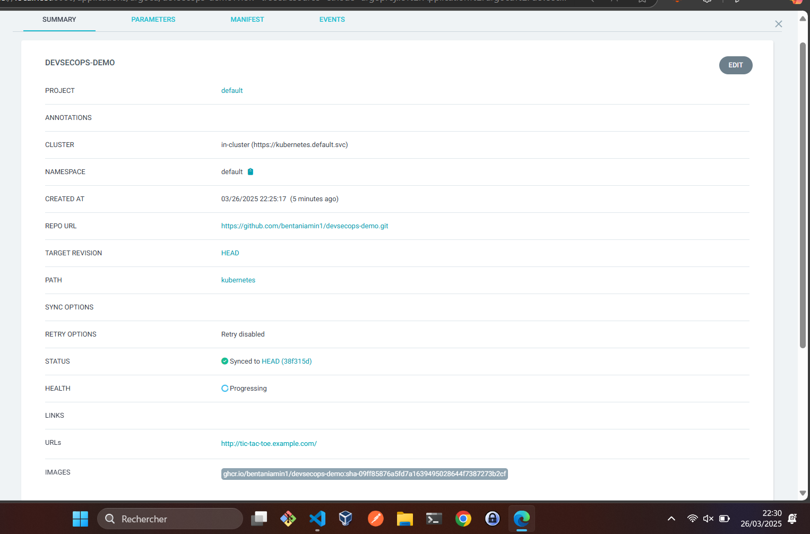
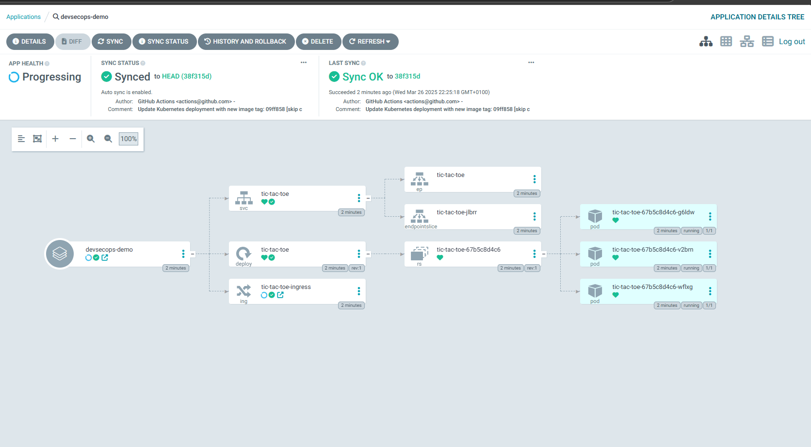
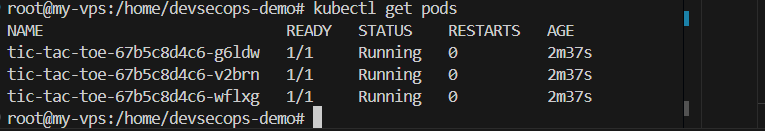
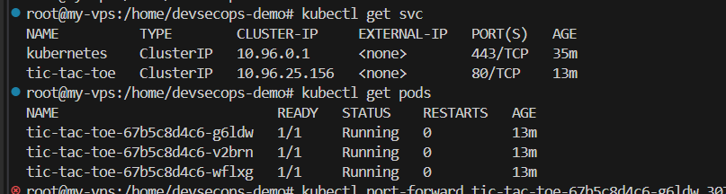
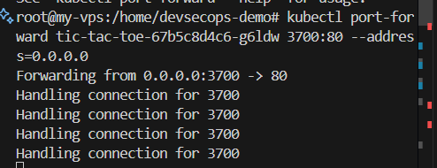
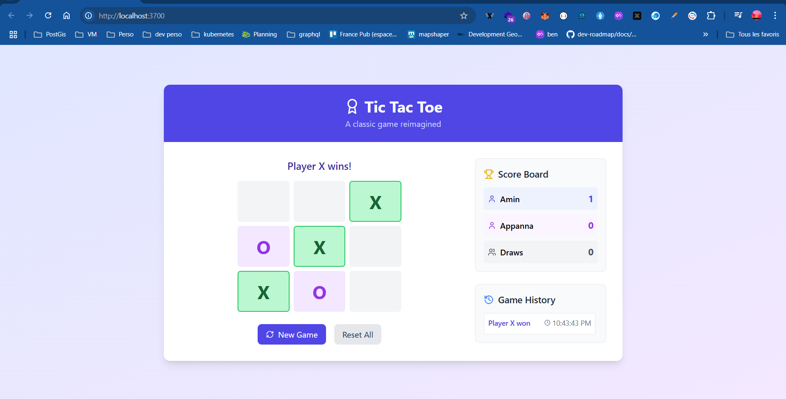

# DevSecOps Pipeline Implementation for Tic Tac Toe Game


## Features

- 🎮 Fully functional Tic Tac Toe game
- 📊 Score tracking for X, O, and draws
- 📜 Game history with timestamps
- 🏆 Highlights winning combinations
- 🔄 Reset game and statistics
- 📱 Responsive design for all devices

## Technologies Used

- React 18
- TypeScript
- Tailwind CSS
- Lucide React for icons

## Project Structure

```
src/
├── components/
│   ├── Board.tsx       # Game board component
│   ├── Square.tsx      # Individual square component
│   ├── ScoreBoard.tsx  # Score tracking component
│   └── GameHistory.tsx # Game history component
├── utils/
│   └── gameLogic.ts    # Game logic utilities
├── App.tsx             # Main application component
└── main.tsx           # Entry point
```

## Game Logic

The game implements the following rules:

1. X goes first, followed by O
2. The first player to get 3 of their marks in a row (horizontally, vertically, or diagonally) wins
3. If all 9 squares are filled and no player has 3 marks in a row, the game is a draw
4. Winning combinations are highlighted
5. Game statistics are tracked and displayed

## Getting Started

### Prerequisites

- Node.js (v14 or higher)
- npm or yarn

### Installation

1. Clone the repository:
   ```bash
   git clone https://github.com/yourusername/devsecops-demo.git
   cd devsecops-demo
   ```

2. Install dependencies:
   ```bash
   npm install
   # or
   yarn
   ```

3. Start the development server:
   ```bash
   npm run dev
   # or
   yarn dev
   ```

4. Open your browser and navigate to `http://localhost:5173`

## Building for Production

To create a production build:

```bash
npm run build
# or
yarn build
```

The build artifacts will be stored in the `dist/` directory.


## Build image 

docker buildx build -t devsecops-demo .

docker run -d -p 8080:80 devsecops-demo


## Argo cd on Kubernetes


kubectl create namespace argocd

helm repo add argo https://argoproj.github.io/argo-helm
helm install argocd argo/argo-cd -n argocd

kubectl get pods -n argocd


kubectl -n argocd get secret argocd-initial-admin-secret -o jsonpath="{.data.password}" | base64 -d; echo


## To pull image from ghcr.io, we need create secret in kubernetes
kubectl create secret docker-registry github-container-registry \
  --docker-server=ghcr.io \
  --docker-username=YOUR_GITHUB_USERNAME \
  --docker-password=YOUR_GITHUB_TOKEN \
  --docker-email=YOUR_EMAIL




  
  
  
  
  